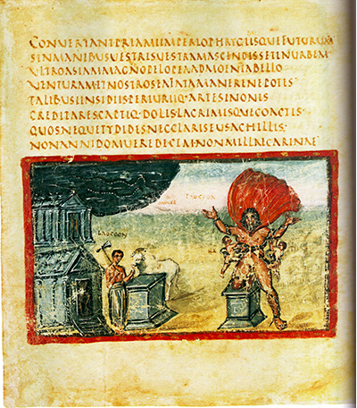
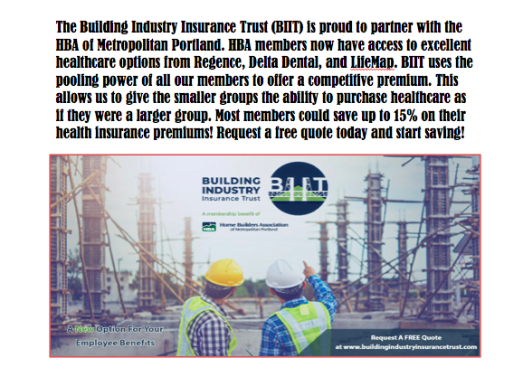
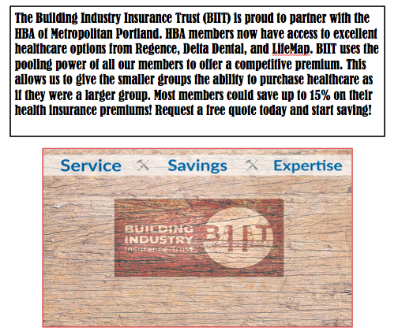

# The Vatican Vergil
# Introduction
The world of marketing and advertising in constantly changing. Companies are constantly having to revamp the way they sell their products. The main focus is communication. How are you going to display your message to your audience? The Vatican Vergil is one of the last stadning historical texts and completely changed the way you display your message. It was the first to incorperate an image with text to draw the audience in. It covers the 3 key factors that we use in advertising today. An attention graber, an attractive image, and context. The Vatican Vergil draws you in with the red outline around the image, the image makes you curious to what this could be about, and the text sells you on what it really is. We refer to this today as an Affective Ad Appeal.

# Why The Vatican Vergil?
The reason why I wanted to research The Vatican Vergil is because this style of text is a very popular marketing stradegy today. With an increase in social media, research shows that 59% of global customers use social media as their motivation to purchase. A majority of social media is used to images like Instagram and Facebook. With people constantly on their phones, incorperating your prodcut with an image brings them in, then the text gives them more information. The main point is that consumers have an attention span of about 3 seconds, you can't sell them in 3 seconds on words, you need imagary. The Vatican was the first to incorperate this style of presenting a text. 

# Historical Context
The Vatican Vergil was beleived to be created for a wealthy artistocrate. Even though the text has been reduced over the years, it is still known to be the most impressive surviving example of illustrated classical literary text.The Vatican Vergile is composed of many images. In the earlier illustrated images, they would only have a title above the illustration. Pages were composed on parchment but were damaged for how often the Vatican Vergil was transported. This is another reason why the Vatican is so important. Illustrations could easily be created with parchment. Parchment is made normally from animal skins such as sheep, which made it available wherever they were (Which was everywhere). This made illustrations much more available. Originally, you would only find Illuminated manuscripts in certain gospel books. Overtime as it gradually became more popular, they would illuminate complete bibles. In the Vatican Vergil image we see the text placed above and the image below. However, it is known for it's bright red surrounding becuase it seperates itself from the rest of the text. This took craftsmenship and images like the Vatican Vergil were only found belonging to people of wealth. As this design begane to become more popular, it hit larger market cities like Paris. As we look at the Vatican Vergil, there isn't emply space between text and image. After writing the text, they would use any empty space for illustrations, giving it a clean and organized look.

# The Adaptation
I work in marketing at my organization so I created a social media advertisment for one of our trusts. We actually ran this as a paid advertisment and received tremedous results. We are a health trust specifically desgined for construction/home builders in metropolitan portland. I used our logo with the construction workers because it connects insurance with construction. Then in my blurb, I talk about savings, expertise, and how great these employee benefits are. I've caught their attention, pitched them on the positives, and how they can receive a free quote instantly. The message is quick and straight to the point, only selling them on positives. Employee benefits is a confusing process and nobody likes to deal with it, the purpose of the ad is to make it sound easy and simple.

# Qualities
When creating the ad, I wanted to keep the image simple, yet attractive. I wanted the image to bring them in, and if they make it to the text that's great. I wanted to relate to them. In the second ad, I kept the same wording but changed the image. I used photoshop to turn out logo into a wood carving to relate to carpenters. I only used three words, Savings, Service, and Expertise. I wanted the auidence to see these with the wood logo, and think what is this? Then they go into the text to learn more. 

# Culteral Meaning

# Rhetorical Significance
Over the years we have seen this format change, take the newspaper for example. When somebody is deciding to buy a newspaper what is the first thing they see? The cover! Which consists of an image to catch your attention, a small blurb to tell you more, and then usually a fancy text or boxed texted for emphasis.

# Reflection

# Bibliography
Ordenes, F. V., Grewal, D., Ludwig, S., Ruyter, K. D., Mahr, D., & Wetzels, M. (2019). Cutting through Content Clutter: How Speech and Image Acts Drive Consumer Sharing of Social Media Brand Messages. Journal of Consumer Research, 45(5), 988–1012

Arogundade, O. T. (2017). Consumer, Marketing and Advertising Psychology. IFE PsychologIA, 25(1), 569–574. 

Hongsik John Cheon, Chang-Hoan Cho, & Sutherland, J. (2007). A Meta-Analysis of Studies on the Determinants of Standardization and Localization of International Marketing and Advertising Strategies. Journal of International Consumer Marketing, 19(4), 109–147.

